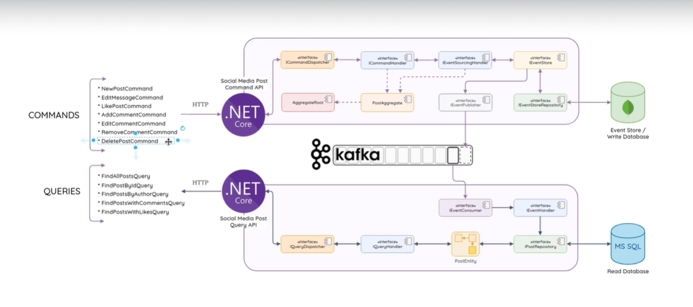

# Social media platform
Hobby project - social media post web api - inspired by [course](https://eshopworld.udemy.com/course/net-microservices-cqrs-event-sourcing-with-kafka/).

## Used technologies
- .NET 7 with C# Web APIs
- CQRS + Event Sourcing:
  - Kafka straming platform - for pumping (Command API) and dispatching (Query API) system state changes
  - NoSql MongoDb - for write efficient Event Sore 
  - Microsoft SQL Server - for read views

## Architecture diagram

